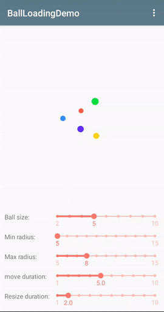

# BallLoadingView

A lightweight and highly configurable ball loading animation view.This project re-implemented all the animation effects of [loading-balls](https://github.com/glomadrian/loading-balls) in a more lightweight way, and solved the problem of stuttering, which is easier to expand.

## Getting started

#### Gradle

**Step 1.** Add the JitPack repository to your build file

Add it in your root build.gradle at the end of repositories:

```groovy
	allprojects {
		repositories {
			...
			maven { url 'https://jitpack.io' }
		}
	}
```

**Step 2.** Add the dependency

```groovy
	dependencies {
	       implementation 'com.github.prostory:BallLoadingView:v1.1'
	}
```

#### Maven

**Step 1.** Add the JitPack repository to your build file

```xml
	<repositories>
		<repository>
		    <id>jitpack.io</id>
		    <url>https://jitpack.io</url>
		</repository>
	</repositories>
```

**Step 2.** Add the dependency

```xml
<groupId>com.github.prostory</groupId>
<artifactId>BallLoadingView</artifactId>
<version>v1.1</version>
```

## How to use

We can use `BallLoadingView` directly in the layout file:

```xml
<com.prostory.ballloading.BallLoadingView
        android:id="@+id/loadingView"
        android:layout_width="100dp"
        android:layout_height="100dp"
        app:colors="@array/loadingColors"
        app:ballSize="5"
        app:minRadius="5dp"
        app:maxRadius="8dp"
        app:moveDuration="5000"
        app:resizeDuration="2000"
       	app:trackType="infinite" />
```

#### app:colors

Array of colors for the balls, if there are more balls than colors then repeat color balls

```xml
<?xml version="1.0" encoding="utf-8"?>
<resources>
    <color name="ball1">#FFD91C</color>
    <color name="ball2">#FF4B4A</color>
    <color name="ball3">#3D8EFF</color>
    <color name="ball4">#611CFF</color>
    <color name="ball5">#12FF45</color>

    <integer-array name="loadingColors">
        <item>@color/ball1</item>
        <item>@color/ball2</item>
        <item>@color/ball3</item>
        <item>@color/ball4</item>
        <item>@color/ball5</item>
    </integer-array>
</resources>
```

#### app:ballSize

The number of balls, if you don’t set it, the default number is the length of the color array you set by `app:colors`

#### app:minRadius

The radius of the smallest ball, its value cannot be greater than `maxRadius`. If its value is equal to `maxRadius`, the size of the ball will not change during the animation.

#### app:maxRadius

The radius of the largest ball, its value cannot be less than `minRadius`, if its value is equal to `minRadius`, the size of the ball will not change during the animation.

#### app:moveDuration

The duration of the animation of the ball moving along the track.

#### app:resizeDuration

The duration of the animation of the ball changing size.

#### app:trackType

The track type of the ball movement. The default track type is `Infinite`, you can replace the following track types according to your needs:

> *  infinite
> *  square
> *  triangle
> *  circle
> *  diamond
> *  star

Or you can also customize a small ball movement track:

```kotlin
loadingView.track = object: RunningTrack {
    override fun getPath(radX: Float, radY: Float, ballRadius: Float, ballSize: Int): Path {
        return Path().also { 
            it.addOval(ballRadius, ballRadius,
                       2 * radX - ballRadius, 2 * radY - ballRadius, Path.Direction.CW)
        }
    }
}
```

The above code defines a small ball running track, let the ball move along an ellipse.

I also provide an demo that can see the configuration effect in real time. You can adjust the configuration in the demo to achieve the loading animation effect you want.

